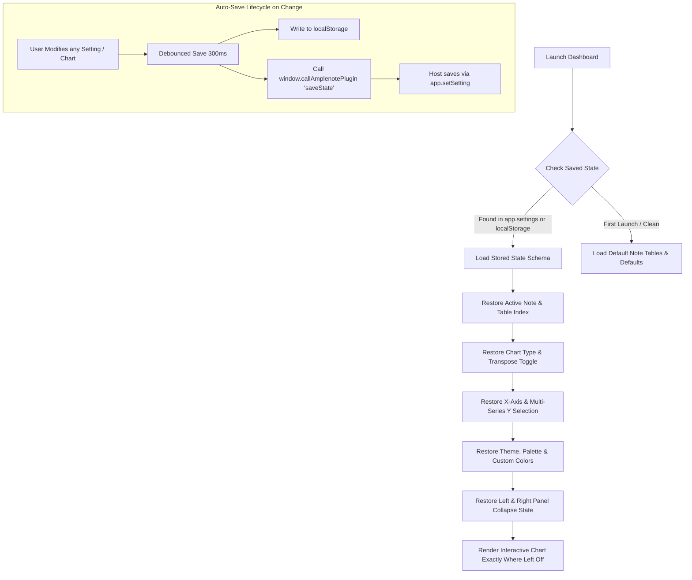
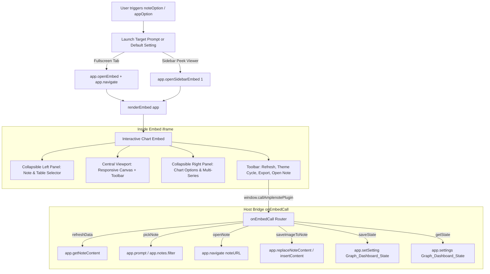

- Update the Options that it is available in - called in from.
	- noteOption - Download, Viewer, Update. > Dashboard Viewer only Option.
	- Change in-note embed to open embed in large screen. - reference: metadata testing.
		- app.openEmbed or app.openSidebarEmbed.
- Make it compatible for large, medium and small screens.
	- Collapsible left and right selection window.
- Theming support - cyclic theming.
- Should show the Note Name. - With an edit button to change the note and table in it.
- Ability to change the line or bar color.
- Old Bug Fix - Multiple columns or rows selection.
- Option to Save the Image - above the Table in the Note. - With appropriate Spacing.
- Other New features that the packages provide.
- Mention note name and heading name in table name under "Select table" (eg. `Note 1: Header 1: Table 1`)
- Add a refresh button in the embed.
- When downloaded, the html should have a favicon.
- Open Note - navigate option added to the embed.
- Add all columns or rows into Bar or Line Charts. Add an another Option to bring in all the columns or rows data into the map for mapping.
	- Note: Bring it only for Line, Area, Bar, Histogram.
- Provide a download Image option or save image option or copy image option to the Interactive charts.
	- Already works with right click and save image!
- General:
	- All Bug Fixes.
	- Check if everything is functional and clean integrity check Done!

---

- **State Persistence (Resume where left off)**:
  - If closed and reopened, restore exact session state:
    - Last active Note & Table selection
    - Selected Chart Type & configuration (Transpose, smooth curves, stacked, etc.)
    - Multi-series X and Y column/row selections
    - Custom colors / selected theme
    - Collapsible left/right sidebar open/close states
  - Dual-layer persistence via `localStorage` (instant local cache) and `app.setSetting` (cloud/cross-device sync).

---

# Graph Utility (anp-09) — Feature Roadmap & Execution Plan

This plan addresses all requirements in [ds.md](file:///c:/Users/ADMIN/OneDrive/Documents/GitHub/amplenote_stg_plugins/anp-09-graph-utility/ds.md) based on the [Amplenote Plugin API](https://www.amplenote.com/help/developing_amplenote_plugins) and existing architecture in [anp-09-graph-utility](file:///c:/Users/ADMIN/OneDrive/Documents/GitHub/amplenote_stg_plugins/anp-09-graph-utility).

---

## 1. Feasibility Checks & Amplenote API Analysis

| Feature in `ds.md` | Feasibility | Amplenote API Mechanism / Implementation Path |
| :--- | :--- | :--- |
| **1. Consolidated noteOption / Dashboard Viewer** | ✅ High | Consolidate `Download!`, `Viewer!`, `Update!` into `Open Graph Dashboard` in `noteOption` (and `appOption` for global access). Embed handles downloading, switching notes, and refreshing internally. |
| **2. Large Screen / Embed Launch Target** | ✅ High | Use `app.openEmbed()` + `app.navigate("https://www.amplenote.com/notes/plugins/" + app.context.pluginUUID)` for full dashboard tab, or `app.openSidebarEmbed(1)` for Peek Viewer (remembering user preference). |
| **3. Responsive Layout (Large, Medium, Small Screens)** | ✅ High | Implement collapsible sidebars (left: data source & table selection; right: chart configuration & colors) using CSS Grid/Flexbox with media queries and drawer toggle icons. |
| **4. Cyclic Theming** | ✅ High | Add a theme switcher cycle (*Light ➔ Dark ➔ Midnight ➔ Forest ➔ Cyberpunk*). Update CSS custom variables and trigger `chart.update()` with matching palette colors, axes grids, and legend typography. |
| **5. Note Name & Switcher with Edit / Note Picker** | ✅ High | Show active note title in header. "Switch Note" triggers `window.callAmplenotePlugin("pickNote")` ➔ `app.prompt()` or note selector to switch active note and reload tables seamlessly without closing embed. |
| **6. Color Customization (Lines, Bars, Datasets)** | ✅ High | Built-in color picker and palette presets (Pastel, Vivid, Neon, Monochrome, Corporate) in the chart settings panel. |
| **7. Multi-Column / Multi-Row Selection Bug Fix** | ✅ High | Replace single-value `<select>` with checkbox list / multi-select pill selector for Y-axes series. Update dataset generation logic to handle multiple series dynamically. |
| **8. Save Image Above Table in Note** | ✅ High | `canvas.toDataURL('image/png')` sent via `window.callAmplenotePlugin("saveImageToNote")`. Plugin uses `app.getNoteContent()`, locates table index/heading, and prepends image markdown or footnote with spacing (`\\ \n`). |
| **9. New Chart Packages & Types** | ✅ High | Support Chart.js types: Line, Bar, Stacked Bar, Grouped Bar, Area, Pie, Doughnut, Radar, Polar Area, Scatter, and Histogram aggregation. |
| **10. Heading & Note Label in Table Picker** | ✅ High | Enhance [markdownParser.js](file:///c:/Users/ADMIN/OneDrive/Documents/GitHub/amplenote_stg_plugins/anp-09-graph-utility/lib/utils/markdownParser.js) to track preceding markdown headings (`#`, `##`, `###`) and generate labels formatted as: `Note Name > [Heading] > Table N (Cols x Rows)`. |
| **11. Refresh Button in Embed** | ✅ High | Refresh button calls `window.callAmplenotePlugin("refreshData", { noteUUID })` ➔ re-reads markdown via `app.getNoteContent()`, parses tables, and updates the view without losing user chart type preference. |
| **12. Standalone HTML Favicon** | ✅ High | Include embedded SVG / base64 Data URI favicon in `<link rel="icon" ...>` inside [htmlTemplate.js](file:///c:/Users/ADMIN/OneDrive/Documents/GitHub/amplenote_stg_plugins/anp-09-graph-utility/lib/ui/htmlTemplate.js) so downloaded HTML has a self-contained icon. |
| **13. "Open Note" Direct Navigation** | ✅ High | Embed action calls `window.callAmplenotePlugin("openNote", { noteUUID })` ➔ executes `app.navigate("https://www.amplenote.com/notes/" + noteUUID)`. |
| **14. "Select All" Columns/Rows Toggle** | ✅ High | "Select All" button for multi-series charts (Line, Area, Bar, Histogram) to populate all numeric columns into datasets in 1 click. |
| **15. Download / Copy / Save Image Options** | ✅ High | 1-click Download (PNG/SVG/JPEG), 1-click Copy to Clipboard (`navigator.clipboard.write`), and 1-click Insert to Note. |
| **16. State Persistence (Resume Where Left Off)** | ✅ High | Dual-layer persistence using `localStorage` for instant local caching and `app.setSetting("Graph_Dashboard_State", ...)` for cloud/cross-device restoration. |

---

## 2. State Persistence Specification (Resume Where Left Off)

When the user leaves or closes the Graph Dashboard and returns later, the exact workbench state is automatically restored:



### Stored State Schema
```typescript
interface GraphDashboardState {
  version: number;
  lastActiveNoteUUID: string;
  lastActiveNoteName: string;
  activeTableKey: string;           // e.g. "table-0" or heading signature
  chartType: string;               // e.g. "line", "bar", "area", "radar"
  isTransposed: boolean;
  selectedXAxis: string;           // Column or row header
  selectedYSeries: string[];       // Array of selected column/row headers
  selectAllY: boolean;
  activeTheme: string;             // "light" | "dark" | "midnight" | "forest" | "cyberpunk"
  customColorPalette: string[];    // Custom series colors
  chartOptions: {
    smoothCurves: boolean;
    fillArea: boolean;
    stacked: boolean;
    showGrid: boolean;
    showLegend: boolean;
  };
  uiState: {
    leftPanelCollapsed: boolean;
    rightPanelCollapsed: boolean;
  };
  updatedAt: number;
}
```

---

## 3. Amplenote Integration & Options Architecture



---

## 4. Phased Execution Plan

### Phase 1: Lifecycle, Host Communication & Persistence Bridge
- Update [Graph Utility.js](file:///c:/Users/ADMIN/OneDrive/Documents/GitHub/amplenote_stg_plugins/anp-09-graph-utility/Graph%20Utility.js) to:
  - Consolidate `noteOption` into `"Open Graph Dashboard"` (deprecating the separate `Update!` and `Download!` options).
  - Add `appOption: { "Open Graph Dashboard": ... }` to enable dashboard launch from anywhere.
  - Pass initial saved state directly to `renderEmbed(app)`.
  - Implement `onEmbedCall(app, actionName, payload)` router handling:
    - `"saveState"`: Persists `Graph_Dashboard_State` via `app.setSetting`.
    - `"getState"`: Returns saved state from `app.settings`.
    - `"refreshData"`: Re-reads current note content and returns parsed tables.
    - `"pickNote"`: Prompts user to select a note or search by tag, returns new tables.
    - `"openNote"`: Navigates directly to `https://www.amplenote.com/notes/${uuid}`.
    - `"saveImageToNote"`: Inserts/prepends chart image directly above the corresponding table in the note.
    - `"downloadCSV"`: Generates and returns CSV string.

### Phase 2: Markdown & Heading Context Parser Enhancements
- Refactor [markdownParser.js](file:///c:/Users/ADMIN/OneDrive/Documents/GitHub/amplenote_stg_plugins/anp-09-graph-utility/lib/utils/markdownParser.js) to:
  - Parse markdown line by line, maintaining a heading stack (`# H1`, `## H2`, `### H3`).
  - Return structured table metadata objects with stable IDs for reliable state restoration:
    ```javascript
    {
      id: "table-1",
      index: 1,
      heading: "Q3 Financials",
      displayName: "Note Name > Q3 Financials > Table 1 (4 cols x 12 rows)",
      rawMarkdown: "...",
      headers: ["Month", "Revenue", "Expenses", "Net Profit"],
      rows: [ ... ],
      isNumericCol: [false, true, true, true]
    }
    ```
  - Enhance [tableTranspose.js](file:///c:/Users/ADMIN/OneDrive/Documents/GitHub/amplenote_stg_plugins/anp-09-graph-utility/lib/utils/tableTranspose.js) and [csvConverter.js](file:///c:/Users/ADMIN/OneDrive/Documents/GitHub/amplenote_stg_plugins/anp-09-graph-utility/lib/utils/csvConverter.js) to work with structured table objects.

### Phase 3: Responsive UI, Theming & State Manager
- Rewrite [htmlTemplate.js](file:///c:/Users/ADMIN/OneDrive/Documents/GitHub/amplenote_stg_plugins/anp-09-graph-utility/lib/ui/htmlTemplate.js):
  - **State Manager Module**:
    - Centralized `AppState` object syncing with `localStorage` and `onEmbedCall('saveState')`.
    - State hydration function running on boot to restore table, chart, axes, theme, and sidebar states.
  - **Layout**: 3-pane responsive layout with collapsible side panels (`#left-panel`, `#chart-viewport`, `#right-panel`).
  - **Screen Adaptation**: Flex/Grid layout with automatic collapse on smaller screens (<900px) and drawer toggle buttons.
  - **Cyclic Theming**:
    - Theme palettes: *Amplenote Light*, *Obsidian Dark*, *Midnight Blue*, *Cyberpunk/Emerald*, *Nordic Gray*.
    - Dynamic update of CSS variables and Chart.js global theme defaults.
  - **Embedded Favicon**: Add SVG/Base64 favicon in `<head>`.

### Phase 4: Advanced Charting & Multi-Series Selection
- Support multiple Y-axis series:
  - Multi-select column/row selector with "Select All" toggle button for Line, Bar, Stacked Bar, Grouped Bar, Area, and Histogram.
  - Color palette selection per dataset or global palette picker (with custom color input per series).
  - Live data summary badge (Total rows, parsed columns, numeric ranges).

### Phase 5: Export & Interactivity Capabilities
- **Image Actions**:
  - Download as PNG/JPEG.
  - Copy Image to Clipboard (`navigator.clipboard.write`).
  - Save Image to Note: Embed calls `saveImageToNote`, host inserts image markdown before the table with standard spacing `\\\n`.
- **Note Navigation**: "Jump to Note" button opening the note in Amplenote.
- **Live Refresh**: Refresh button re-fetching note data without resetting current user chart selections.

### Phase 6: Verification, Testing & Bundling
- Add automated unit tests under `test/` for:
  - State serialization, hydration, and fallback handling.
  - Table extraction with heading hierarchy.
  - Transposition and multi-series parsing.
  - `onEmbedCall` handlers and error resilience.
- Run `npm test` and verify code integrity.
- Run `anp_bundle` to generate the production single-file bundle.
- Update `README.md`, `RELEASE_NOTES.md`, and `CODE_DOCUMENTATION.md`.
